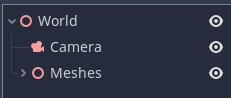
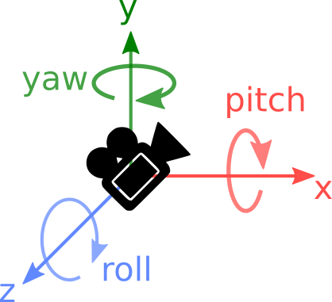
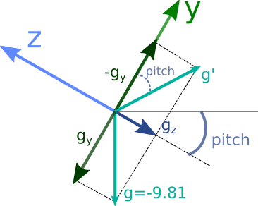

# Using Cell Phone Sensors for 3D Transformations

## Introduction

It's a well-known fact that our mobile devices come equipped with all kinds of sensors used for various features that we tend to take for granted. For example, a phone knows if it's held in portrait or landscape orientation, it knows if you're walking in a certain direction, and it can even detect if you've left it on a table screen-up or screen-down. All of this information is calculated internally using various electronic sensors. But, can we make use of these sensors for our games? The answer is yes, and it's relatively straightforward.

In this blog post, you will learn how to use mobile phone sensors to control the transformations of objects in the Godot Engine.

## Scope

This post will cover the following topics:

* Understanding the concepts of pitch, roll, and yaw in 3D space.
* Using the gyroscope to set the pitch, roll, and yaw.
* Using the accelerometer and magnetometer to set the pitch, roll, and yaw.
* Combining all three sensors for better control.

Throughout the post, we will use these values to control the camera node of the scene.

## Prerequisites

To follow this tutorial you will need:

* Some knowledge of the Godot Engine
* A mobile phone with __gyroscope__, __magnetometer__ and __accelerometer__
* Basic math skills (trigonometry mainly)
* Basic physics knowledge
* Everything set up to export to [Android](https://docs.godotengine.org/es/stable/tutorials/export/exporting_for_android.html) or [iOS](https://docs.godotengine.org/es/stable/tutorials/export/exporting_for_ios.html) 

## Setting Up The Project

The project required for this tutorial is simple. Just use a _Spatial_ node as the root of your scene, and add a _Camera_ node to it. You should also add some meshes to have as a reference for when we start moving the camera. Your base project should look something like this:



## A First Approach: The __Gyroscope__

We're going to use sensors to orient the camera in our game. To do this, we need to understand some basic definitions of camera rotation. With the axis convention used in the Godot engine, we can define the following:

* __Pitch__: rotation arround the __x-axis__.
* __Roll__: rotation arround the __z-axis__.
* __Yaw__: rotation arround the __y_axis__.



Our goal is to determine these three parameters using our cellphone sensors.

Let's start by looking at the __gyroscope__. A __gyroscope__ gives us the __angular velocity__ in radians per second ($rad/s$). This means that the sensor tells us how fast the device is rotating on each axis. As we know from basic physics, multiplying _velocity_ by _elapsed time_ gives us the _distance_ traveled in that time. The same principle applies to __angular velocity__: multiplying it by elapsed time gives us the change in angle in that time. Godot makes it easy to get this value with its `Input` system. So let's use this to get the __pitch__ for our camera.

Add a script to the camera with the following code:

```swift
extends Camera

var pitch: float = 0.0

func _physics_process(delta):
	var gyroscope: Vector3 = Input.get_gyroscope()
	pitch += gyroscope.z * delta
	
	rotation.z = pitch
```

Run your project now on your device, and move it around. You will notice that the camera moves accordingly! 

So lets complete the previous script for __roll__ and __yaw__:

```swift
extends Camera

var pitch: float = 0.0
var roll: float = 0.0
var yaw: float = 0.0

func _physics_process(delta):
	var gyroscope: Vector3 = Input.get_gyroscope()
	pitch += gyroscope.x * delta
	roll += gyroscope.z * delta
	yaw += gyroscope.y * delta
	
	rotation = Vector3(pitch, yaw, roll)
```

Try it again and see that now you can freely rotate your camera to inspect the scene! You can now control the orientation of your camera using your mobile phone. Great! But we're not done yet.

If you played around enough with the previous code, you will soon note that if the roll is $\pi/2$, __yaw__ and __pitch__ stop working as desired. This is because, in the __object coordinates__, if $roll = \pi/2$ the __yaw__ should be considered around the __x-axis__ since this is the axis parallel to the earth now. Similarly, the __pitch__ should now be considered around the __y-axis__. This can be fixed by applying the __roll__ also to the __gyroscope__ data:

```swift
var gyroscope: Vector3 = Input.get_gyroscope().rotated(-Vector3.FORWARD, roll)
```

*Note: Remember that in Godot `Vector3.FORWARD` is a vector pointing in the opposite direction of the __z axix__.*


So, are we done now? Unfortunately, no...

Gyroscopes are cool sensors, but they have a problem: they tend to drift. If you move your camera around a lot and then put your phone in the same orientation it had when the game started, likely, you won't get the same view as when the game launched.

## Using The __Accelerometer__ For __Pitch__ And __Roll__

The __accelerometer__ is a sensor that, measures _acceleration_ in units of $m/s^2$ (although iOS devices will likely measure it in units of $g$, with $1g \approx 9.81 m/s^2$). In a rest position, __accelerometers__ will measure the $9.81 m/s^2$ in the direction to the center of the earth caused by gravity. This makes them useful to detect the orientation of a device relative to the earth.

Godot provides two measurements with the __accelerometer__:

* `Input.get_accelerometer()`: gives you the sensor values in each axis.
* `Input.get_gravity()`: gives you the values but only takes into account gravity.

The latter is better for measuring __pitch__ and __roll__.

We can use the _gravity_ value to get the __pitch__ and the __roll__, but we won't be able to get the __yaw__ as the gravity resultant is always parallel to the __y-axis__. 

If you don't care much about the math, just use this code and skip the next section:

```swift
func _physics_process(delta):	
	var gravity: Vector3 = Input.get_gravity()
	roll = atan2(-gravity.x, -gravity.y) 
	gravity = gravity.rotated(-Vector3.FORWARD, rotation.z)
	pitch = atan2(gravity.z, -gravity.y)
	
	rotation = Vector3(pitch, yaw, roll)
```

#### Math Justification

Trying to not go very deep with math, this picture is provided to help visualize the situation, which assumes that the __roll__ is equal to $0$ (the __x-axis__ is parallel to the ground) and only considers the __z__ and __y__ axes. 



The picture shows the local axes of the device when some __pitch__ is applied. By definition, the __pitch__ is the angle between the horizontal and the __z-axis__ (i.e. the rotation around the __x-axis__). The magnitudes $g_y$ and $g_z$ represent the gravity measurements in those axes, as read by the __accelerometer__. The resultant gravity should always be a vector pointing downwards with a magnitude of approximately $9.81m/s^2$.

By inverting $g_y$, we can get $g'$, and using trigonometry, it can be seen that the angle between $-g_y$ and $g'$ is equal to the __pitch__. This angle can be calculated using the formula `atan2(gravity.z, -gravity.y)`.

To account for cases when __roll__ is not equal to $0$, the gravity vector needs to be rotated by the __roll__ value, which can be done using the code `gravity = gravity.rotated(-Vector3.FORWARD, rotation.z)`.

The formula for the __roll__ value can be obtained through a similar analysis, and is given by `roll = atan2(-gravity.x, -gravity.y)`.

## Using The Magnetometer For __Yaw__

To determine the __yaw__, we use the __magnetometer__. This sensor measures the _magnetic fields_ and is capable of detecting the direction of the north pole due to the earth's magnetic field. By considering it as an accelerometer that points towards the north, we can calculate the __yaw__ value in a similar way than we did for __roll__ and __pitch__:
	
```swift
yaw = atan2(-magnet.x, magnet.z)
```

However, there are two factors to consider when calculating __yaw__.  First, we need to rotate the readings from the magnetometer to take the __roll__ and __pitch__ into account. 

```swift
var magnet: Vector3 = Input.get_magnetometer().rotated(-Vector3.FORWARD, rotation.z).rotated(Vector3.RIGHT, rotation.x)
yaw = atan2(-magnet.x, magnet.z)
```

Secondly, to align the __yaw__ value with the world coordinates in our game, we need to calculate an initial __yaw__ value and subtract it from all subsequent calculations. The resulting script is:

```swift
extends Camera

var pitch: float = 0.0
var roll: float = 0.0
var yaw: float = 0.0

var initial_yaw : float = 0.0

func _ready():
	yield(get_tree(),"idle_frame")
	var magnet: Vector3 = Input.get_magnetometer()
	initial_yaw = atan2(-magnet.x, magnet.z) 

func _physics_process(delta):
	var magnet: Vector3 = Input.get_magnetometer().rotated(-Vector3.FORWARD, rotation.z).rotated(Vector3.RIGHT, rotation.x)
	var gravity: Vector3 = Input.get_gravity()
	roll = atan2(-gravity.x, -gravity.y) 
	gravity = gravity.rotated(-Vector3.FORWARD, rotation.z)
	pitch = atan2(gravity.z, -gravity.y)
	yaw = atan2(-magnet.x, magnet.z)
	
	rotation = Vector3(pitch, yaw - initial_yaw, roll)
```

_Note: you need to wait for a frame before getting the __magnetometer__ reading in `_ready()`, otherwise it will return `Vector3.ZERO`._

We achieved our camera movement using another approach, but this method is not perfect either. As previously mentioned, __gyroscopes__ have _drift_ issues, but __magnetometers__ and __accelerometers__ aren't a silver bullet either: they have _noise_. If your sensors are cheap as mine, you will notice the camera orientation is not smooth at all, particularly in regards to __yaw__. 

__Gyroscopes__ have little _noise_ but a lot of _drift_, and __magnetometers__ and __accelerometers__ have little _drift_ but a lot of _noise_. Fortunately, mathematical techniques allow us to combine the benefits of both sensors, providing a better solution!

## Improvement using the three sensors

There are several methods for combining the readings from the three sensors to get a more accurate estimation of orientation values. However, for our purposes, the simplest solution will suffice.

We can get __roll__, __pitch__, and __yaw__ from both the __gyroscope__ and the __accelerometer__/__magnetometer__. By taking a _weighted average_ of these values, we can mitigate the _drift_ from one measure and the _noise_ from the other. For example, to calculate the __roll__ value, we can use the following code:

```
roll = k (roll + gyroscope.z * delta) + (1-k) * roll_acc
```

Here, `k` is a constant between $0$ and $1$, and `roll_acc` is the __roll__ value calculated with the accelerometer. A value of `k` close to $1$ will result in the __gyroscope__ being primarily used to calculate the __roll__ while in motion, with the __accelerometer__ "correcting" the estimation over time, especially while stationary. This is known as a _complementary filter_.

There is one final challenge: the __roll__ calculated with a __gyroscope__ can increase without bonds, but the one calculated with the __accelerometer__ is limited to the range $[-\pi, \pi]$. This can result in "jumps" in the values when the gyroscope's __roll__ exceeds $\pi$, as the __accelerometer__ will then report a value near $-\pi$.

Godot comes to the rescue again! The _complementary filter_ is essentially a linear interpolation between the two values, and Godot has a function specifically designed to interpolate between angles while wrapping them correctly. This function is `lerp_angle()` and in this case, we can use it like this:

```swift
roll = lerp_angle(roll_acc, roll + gyroscope.z * delta, k)
```

With this in mind, the final code results in:

```swift
extends Camera

var pitch: float = 0.0
var roll: float = 0.0
var yaw: float = 0.0

var initial_yaw : float = 0.0

var k : float = 0.98

func _ready():
	yield(get_tree(),"idle_frame")
	var magnet: Vector3 = Input.get_magnetometer()
	print(magnet)
	initial_yaw = atan2(-magnet.x, magnet.z) 

func _physics_process(delta):
	var magnet: Vector3 = Input.get_magnetometer().rotated(-Vector3.FORWARD, rotation.z).rotated(Vector3.RIGHT, rotation.x)
	var gravity: Vector3 = Input.get_gravity()
	var roll_acc = atan2(-gravity.x, -gravity.y) 
	gravity = gravity.rotated(-Vector3.FORWARD, rotation.z)
	var pitch_acc = atan2(gravity.z, -gravity.y)
	var yaw_magnet = atan2(-magnet.x, magnet.z)
	
	var gyroscope: Vector3 = Input.get_gyroscope().rotated(-Vector3.FORWARD, roll)
	pitch = lerp_angle(pitch_acc, pitch + gyroscope.x * delta, k)
	yaw = lerp_angle(yaw_magnet, yaw + gyroscope.y * delta, k)
	roll = lerp_angle(roll_acc, roll + gyroscope.z * delta, k) 
	
	rotation = Vector3(pitch, yaw - initial_yaw, roll)
```

And that's it! With this method, you can now control the `Camera` or any other node that inherits from `Spatial` using the sensors in your phone. The possibilities for creative game design are endless! Have fun experimenting with this technique.

